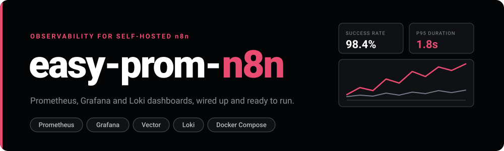
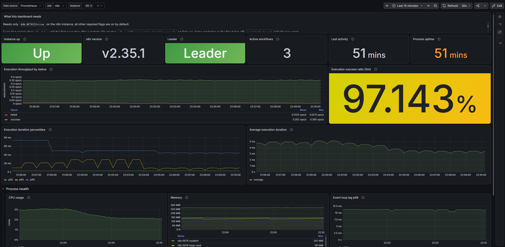
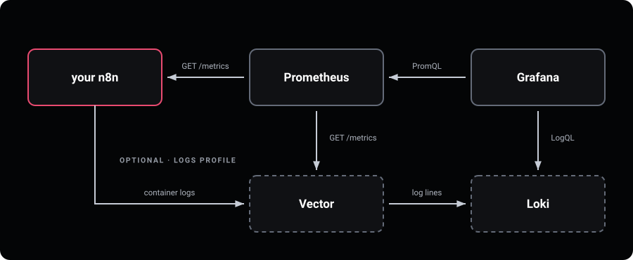
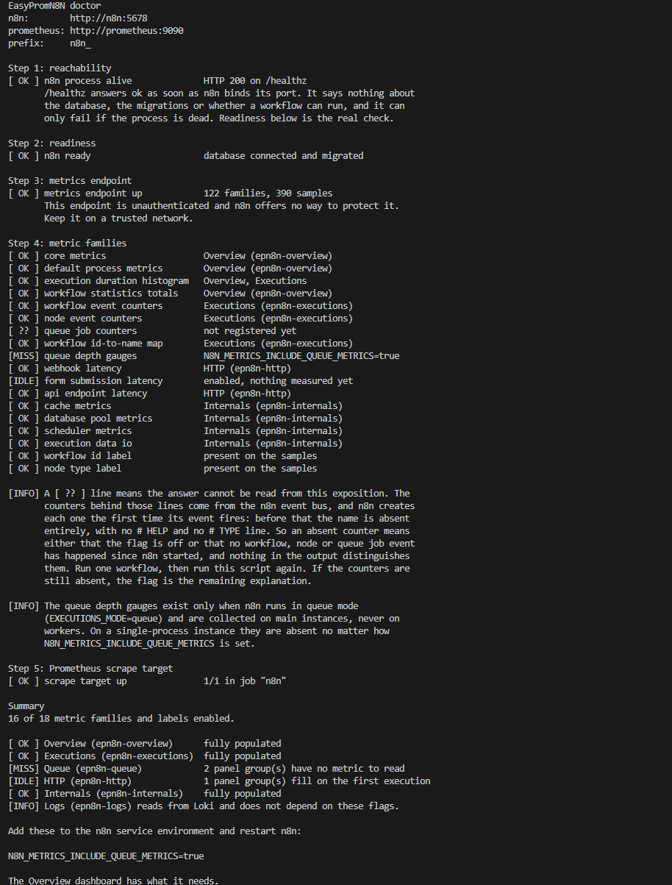
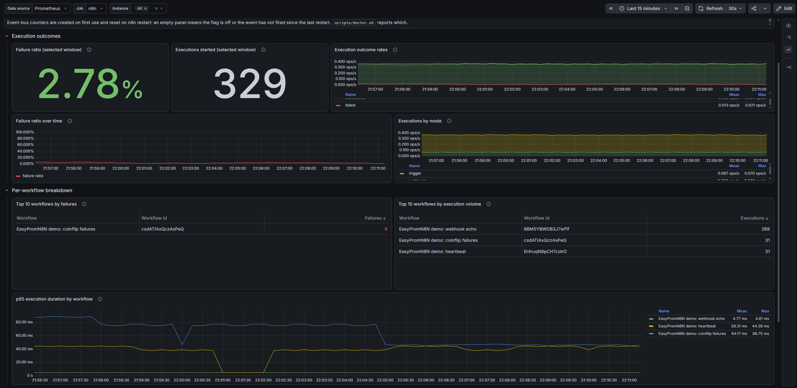
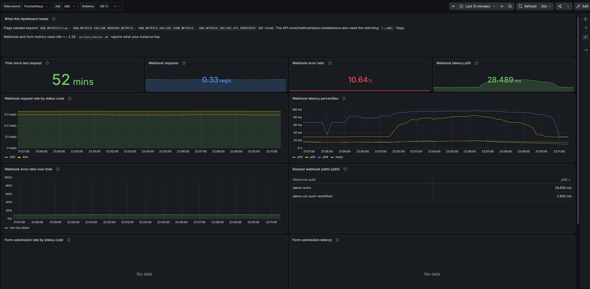
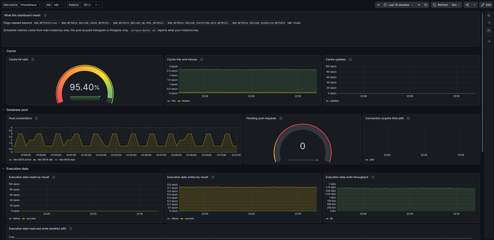
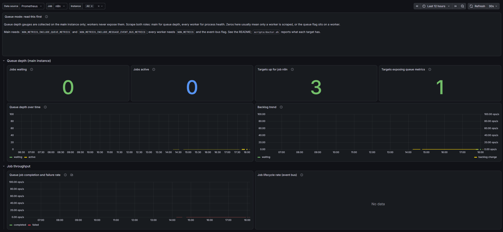
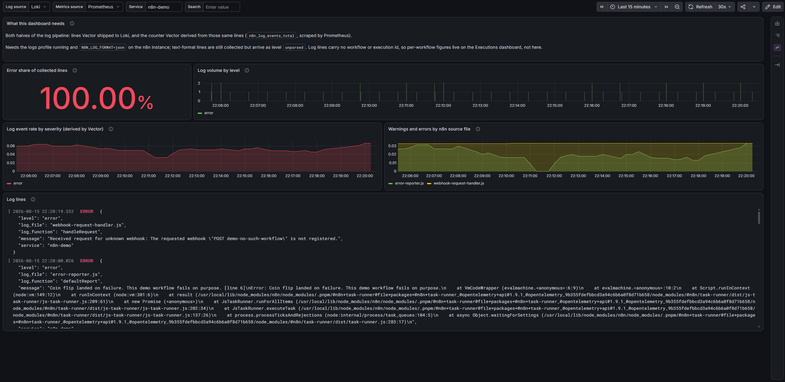

<p align="center">
  
</p>

<p align="center">
  <a href="LICENSE"></a>
</p>

A drop-in Prometheus, Grafana and Loki stack for a self-hosted n8n. It attaches to the instance you already run, and one `docker compose up` gives you six dashboards, five alert rules and searchable logs.

n8n's execution list tells you what happened, one execution at a time. It will not tell you that failures doubled this week, which workflow burns the most time, whether the queue is backing up, or that the process is running out of heap. n8n already publishes all of that on a Prometheus endpoint, which ships off by default and stays unread by most people. This turns it into dashboards and alerts.

You would run it to get paged when a workflow starts failing at three in the morning instead of finding out on Monday, to work out which of forty workflows is behind a slowdown, or to check whether adding workers actually cleared the backlog.

<p align="center">
  
</p>

To look before installing anything, `COMPOSE_PROFILES=demo docker compose up -d` starts a throwaway n8n with live traffic and deliberate failures, and fills the dashboards with data. Queue Mode stays empty, since the demo runs as a single process. It publishes no port, and `docker compose down -v` erases it.

## Architecture

<p align="center">
  
</p>

Prometheus scrapes your n8n's `/metrics` endpoint every 15 seconds and Grafana draws the dashboards from it. That is the whole core: two containers, nothing installed on the n8n side. The logs profile is optional and adds Vector and Loki.

Grafana on `127.0.0.1:3000` is the only published port. Everything else stays on the internal Compose network.

## Install

### 1. Requirements

- Docker with Compose v2 or later
- ~500 MB of disk for images, plus 1–3 GB per month per instance for metrics (kept 15 days by default)
- An n8n that can serve `/metrics`. The webhook and form panels need n8n 2.28 or newer
- A POSIX shell for `doctor.sh`, which on Windows means Git Bash

Verified against n8n 2.35, Prometheus 3.13 and Grafana 13.1.

### 2. Get the stack

```sh
git clone https://github.com/omniops-mm/easy-prom-n8n
cd easy-prom-n8n
cp .env.example .env
```

Open `.env` and set `GRAFANA_ADMIN_PASSWORD`. Compose refuses to start without it. `openssl rand -hex 32` will generate one.

Grafana reads that password only when it first creates its database. Changing it in `.env` later has no effect: change it in Grafana under your profile, or delete the `grafana_data` volume to start over.

### 3. Turn on metrics in n8n

Metrics are off by default. Add these to your n8n's environment and restart it. The first line turns the endpoint on, the rest fill in the executions dashboard:

```sh
N8N_METRICS=true
N8N_METRICS_INCLUDE_MESSAGE_EVENT_BUS_METRICS=true
N8N_METRICS_INCLUDE_WORKFLOW_ID_LABEL=true
N8N_METRICS_INCLUDE_WORKFLOW_INFO=true
```

Where these go depends on how n8n runs: the `environment:` block of its compose service, an `--env-file`, or the shell that starts it. n8n documents the options under [Use environment variables](https://docs.n8n.io/deploy/host-n8n/configure-n8n/basic-configuration/use-environment-variables/), and the endpoint itself under [Enable Prometheus metrics](https://docs.n8n.io/deploy/host-n8n/configure-n8n/basic-configuration/configuration-examples/enable-prometheus-metrics/).

The other dashboards need more flags. Step 5 tells you which, and [Metrics flags](#metrics-flags) lists all of them.

### 4. Tell Prometheus where your n8n is

```sh
cp prometheus/targets/n8n.yml.example prometheus/targets/n8n.yml
```

Edit that file so the target address matches your setup, then start the stack. The example file has a commented line for each case:

| Where your n8n runs | Target address | Start with |
|---|---|---|
| Nowhere yet, just evaluating | leave `n8n:5678` | `COMPOSE_PROFILES=demo docker compose up -d` |
| On this machine, outside Docker | `host.docker.internal:5678` | `docker compose up -d` |
| On another machine | its hostname and port | `docker compose up -d` |
| In its own Compose project | that project's n8n service name | `docker compose -f compose.yaml -f compose.external-network.yaml up -d` |

Two notes. An n8n bound to `127.0.0.1` is unreachable from any container, so set `N8N_LISTEN_ADDRESS=0.0.0.0` on the n8n side if you use the second row. And for the last row, set `N8N_NETWORK` in `.env` to that project's Docker network, usually its directory name plus `_default`; `docker network ls` lists the candidates.

`/metrics` has no authentication, so keep all of this on a private network.

### 5. Check it worked

Grafana is now on **http://127.0.0.1:3000** with everything loaded. To confirm the connection and see which flags are still missing:

```sh
./scripts/doctor.sh http://your-n8n:5678
```

It reads `/metrics` once and reports every metric family as live, idle, absent, or unknowable from the outside. Anything genuinely missing comes back as a paste-ready block to drop into step 3. Add a Prometheus URL as a second argument and it also checks the scrape itself.

<p align="center">
  
</p>

### 6. Collect the logs (optional)

Metrics tell you a workflow failed. The logs tell you why. This step adds Loki for storage and Vector for collection, and works only for a containerised n8n, because Vector reads logs from the Docker daemon.

> **Read this before running it.** The profile gives Vector the Docker socket. That socket is the daemon's full control API, so anything holding it can read every container's environment on the host, passwords included. The read-only mount protects the file, not the API behind it. This is why the profile is opt-in; a socket proxy in front of the daemon removes the exposure.

Set `N8N_LOG_FORMAT=json` on your n8n so the levels parse, then:

```sh
cp prometheus/targets/vector.yml.example prometheus/targets/vector.yml
COMPOSE_PROFILES=logs docker compose -f compose.yaml -f compose.logs.yaml up -d
```

If you are already running the demo, use `COMPOSE_PROFILES=demo,logs` so it keeps running.

Plain-text logs still arrive, tagged `unparsed`. To collect an n8n from another Compose project, add that project's name in `vector/vector.yaml`; the values there are literal, since Vector does not expand environment variables in them.

## Dashboards

Overview is the one you leave open. The other five are drill-downs, split by which part you suspect: the workflows themselves, the callers hitting your webhooks, n8n's own engine, the queue, or the log stream.

| Dashboard | What it answers | Needs beyond `N8N_METRICS=true` |
|---|---|---|
| Overview | Is n8n up, how many executions are running, what share of them fail, how long they take, and is the process healthy | nothing |
| Executions and Workflows | Which workflow fails most, which runs most often, which node types error | event-bus counters, workflow id and info flags |
| Webhooks, Forms and API | How fast n8n answers webhook and form calls, and which of them return errors | webhook, form and API flags (n8n 2.28+) |
| Internals | Whether a slowdown is the cache, the database pool, the scheduler or execution-data IO | cache, DB pool, scheduler, execution data flags |
| Queue Mode | Whether workers are keeping up, and how deep the backlog is | queue flags, both roles scraped |
| Logs | Which subsystem is logging errors and how that rate is moving, plus the lines themselves | the logs profile from step 6 |

Start at Overview, which needs no flags beyond the endpoint. It answers whether there is a problem. The others answer where it is.

Each dashboard also states its own requirements in its top panel. An empty panel means one of two things: the flag is off, or nothing has run since the last n8n restart, because n8n creates those counters lazily. `doctor.sh` tells the two apart.

<p align="center">
  
</p>

<details>
<summary>The other dashboards</summary>

<p align="center">
  
</p>
<p align="center">
  
</p>
<p align="center">
  
</p>
<p align="center">
  
</p>

</details>

Log lines are also searchable in **Explore** with the Loki datasource, for example `{job="easy-prom-n8n"} | json | level="error"`. Loki keeps seven days.

The shipped dashboards are read-only so updates cannot overwrite your work. To make an editable copy: open it, change anything, press Save, choose **Copy JSON to clipboard**, then **Dashboards → New → Import**, paste, rename, press **Change uid**, Import.

## Alerts

Five rules, evaluated and routed by Grafana itself. There is no Alertmanager container because Grafana's unified alerting already does the same job.

| Rule | Fires when |
|---|---|
| N8nInstanceDown | the scrape has been failing for 2 minutes, or the job has no targets |
| N8nHighFailureRate | more than 10% of finished executions failed, for 10 minutes |
| N8nExecutionLatencyHigh | p95 execution time above 30s for 15 minutes |
| N8nQueueBacklog | more than 100 jobs waiting for 10 minutes |
| N8nEventLoopLagHigh | p99 event-loop lag above 0.5s for 5 minutes |

There is deliberately no heap alert. Node reports `heap_size_total` as the heap it has *currently allocated*, not the ceiling it can grow to, so used-over-total sits near 1.0 on a perfectly healthy instance. n8n exposes no metric for the real limit, so the alert cannot be written honestly. Event-loop lag is the signal that actually moves when memory pressure starts to hurt.

They fire out of the box and show up under **Alerting → Alert rules**. To have them delivered somewhere, set the `GF_SMTP_*` variables for mail, or uncomment the Slack or webhook contact point in `grafana/provisioning/alerting/contactpoints.yml`. Thresholds live in `rules.yml` in the same folder; edit and restart the grafana container.

The webhook contact point can point at an n8n webhook workflow, which lets you route alerts anywhere n8n can reach. One exception: never route `N8nInstanceDown` through n8n itself, since that alert must not depend on the thing it watches.

## Queue mode

In queue mode the metrics split across processes. The main carries queue depth, workflow counters and the duration histogram; workers carry node-level counters and their own process health. Scraping one role shows half the picture while looking complete, so list every role in `prometheus/targets/n8n.yml`. The example file has a commented block for this, with the `role` label the queue dashboard splits on. A queue dashboard showing zeros almost always means only a worker is being scraped.

## Reference

### Metrics flags

n8n's metric families sit behind individual opt-in flags. You need this table when a dashboard is empty and you want to know which flag fills it; `doctor.sh` names the missing ones for you, so it is a lookup rather than something to read through.

| Environment variable | What it adds | Dashboard | Cardinality cost |
|---|---|---|---|
| `N8N_METRICS=true` | the `/metrics` endpoint, version and activity gauges | Overview | 3 series |
| `N8N_METRICS_INCLUDE_DEFAULT_METRICS` (default true) | Node.js process metrics: CPU, memory, heap, event loop, GC | Overview | ~30 series, constant |
| `N8N_METRICS_INCLUDE_WORKFLOW_EXECUTION_DURATION` (default true) | execution duration histogram by status and mode | Overview | 19 series per status and mode |
| `N8N_METRICS_INCLUDE_WORKFLOW_STATISTICS` | database-backed totals, refreshed every 300s | Overview | 7 series plus a periodic DB query |
| `N8N_METRICS_INCLUDE_MESSAGE_EVENT_BUS_METRICS` | workflow, node and queue-job lifecycle counters | Executions | 1 series per counter before label flags |
| `N8N_METRICS_INCLUDE_WORKFLOW_ID_LABEL` | `workflow_id` on counters and the histogram | Executions | multiplies by workflows that have run |
| `N8N_METRICS_INCLUDE_WORKFLOW_INFO` | id-to-name mapping gauges (leader main only) | Executions | 2 per workflow, multiplies nothing |
| `N8N_METRICS_INCLUDE_NODE_TYPE_LABEL` | `node_type` on node counters | Executions | 2 per node type in use |
| `N8N_METRICS_INCLUDE_QUEUE_METRICS` | queue depth gauges (queue mode, main only) | Queue | 4 per main |
| `N8N_METRICS_INCLUDE_WEBHOOK_METRICS` | webhook latency histogram (n8n 2.28+) | Webhooks | 9 per label combination |
| `N8N_METRICS_INCLUDE_FORM_METRICS` | form submission histogram (n8n 2.28+) | Webhooks | 9 per label combination |
| `N8N_METRICS_INCLUDE_API_ENDPOINTS` | REST and editor API histogram, `n8n_last_activity` | Webhooks | low alone; the label flags below decide |
| `N8N_METRICS_INCLUDE_API_METHOD_LABEL` | `method` on the API histogram | Webhooks | multiplies by methods in use |
| `N8N_METRICS_INCLUDE_API_STATUS_CODE_LABEL` | `status_code` on the API histogram | Webhooks | multiplies by status codes seen |
| `N8N_METRICS_INCLUDE_CACHE_METRICS` | cache hit, miss and update counters | Internals | 3 series |
| `N8N_METRICS_INCLUDE_DB_POOL_METRICS` | connection pool gauges and acquire histogram (Postgres only) | Internals | ~15 series |
| `N8N_METRICS_INCLUDE_SCHEDULER_METRICS` | scheduler counters and dispatch-lag histogram (main only) | Internals | ~25 series per main |
| `N8N_METRICS_INCLUDE_EXECUTION_DATA_METRICS` | execution data IO counters, durations, sizes | Internals | tens of series |
| `N8N_METRICS_INCLUDE_API_PATH_LABEL` | `path` on the API histogram | none; leave off | one histogram per raw URL, unbounded |

The `*_LABEL` flags multiply series counts by the number of distinct label values, so turn them on deliberately. If you changed `N8N_METRICS_PREFIX` away from the default `n8n_`, the dashboards will not match your metric names. n8n's full list is under [Use environment variables](https://docs.n8n.io/deploy/host-n8n/configure-n8n/basic-configuration/use-environment-variables/).

### Data, upgrades, uninstall

Metrics live in the `prometheus_data` volume for `PROM_RETENTION`, 15 days by default. Grafana's state, including your dashboard copies, lives in `grafana_data`.

To upgrade, pull and bring it back up:

```sh
git pull
docker compose up -d
```

`docker compose down` stops everything and keeps the data. `docker compose down -v` deletes it.

## License

MIT.
